```mermaid
flowchart TB
    subgraph current["Terraria_Wiki.csproj"]
        MAIN["<b>📦&nbsp;Terraria_Wiki.csproj</b><br/><small>net9.0-windows10.0.19041.0</small>"]
        click MAIN "#terraria_wikiterraria_wikicsproj"
    end

```

# Projects and dependencies analysis

This document provides a comprehensive overview of the projects and their dependencies in the context of upgrading to .NETCoreApp,Version=v10.0.

## Table of Contents

- [Executive Summary](#executive-Summary)
  - [Highlevel Metrics](#highlevel-metrics)
  - [Projects Compatibility](#projects-compatibility)
  - [Package Compatibility](#package-compatibility)
  - [API Compatibility](#api-compatibility)
- [Aggregate NuGet packages details](#aggregate-nuget-packages-details)
- [Top API Migration Challenges](#top-api-migration-challenges)
  - [Technologies and Features](#technologies-and-features)
  - [Most Frequent API Issues](#most-frequent-api-issues)
- [Projects Relationship Graph](#projects-relationship-graph)
- [Project Details](#project-details)

  - [Terraria_Wiki\Terraria_Wiki.csproj](#terraria_wikiterraria_wikicsproj)

## Executive Summary

### Highlevel Metrics

| Metric | Count | Status |
| :--- | :---: | :--- |
| Total Projects | 1 | All require upgrade |
| Total NuGet Packages | 5 | 1 need upgrade |
| Total Code Files | 16 |  |
| Total Code Files with Incidents | 17 |  |
| Total Lines of Code | 1933 |  |
| Total Number of Issues | 156 |  |
| Estimated LOC to modify | 154+ | at least 8.0% of codebase |

### Projects Compatibility

| Project | Target Framework | Difficulty | Package Issues | API Issues | Est. LOC Impact | Description |
| :--- | :---: | :---: | :---: | :---: | :---: | :--- |
| [Terraria_Wiki\Terraria_Wiki.csproj](#terraria_wikiterraria_wikicsproj) | net9.0-windows10.0.19041.0 | 🟢 Low | 1 | 154 | 154+ | WinForms, Sdk Style = True |

### Package Compatibility

| Status | Count | Percentage |
| :--- | :---: | :---: |
| ✅ Compatible | 4 | 80.0% |
| ⚠️ Incompatible | 0 | 0.0% |
| 🔄 Upgrade Recommended | 1 | 20.0% |
| ***Total NuGet Packages*** | ***5*** | ***100%*** |

### API Compatibility

| Category | Count | Impact |
| :--- | :---: | :--- |
| 🔴 Binary Incompatible | 18 | High - Require code changes |
| 🟡 Source Incompatible | 127 | Medium - Needs re-compilation and potential conflicting API error fixing |
| 🔵 Behavioral change | 9 | Low - Behavioral changes that may require testing at runtime |
| ✅ Compatible | 5753 |  |
| ***Total APIs Analyzed*** | ***5907*** |  |

## Aggregate NuGet packages details

| Package | Current Version | Suggested Version | Projects | Description |
| :--- | :---: | :---: | :--- | :--- |
| HtmlAgilityPack | 1.12.4 |  | [Terraria_Wiki.csproj](#terraria_wikiterraria_wikicsproj) | ✅Compatible |
| Microsoft.AspNetCore.Components.WebView.Maui | 9.0.120 |  | [Terraria_Wiki.csproj](#terraria_wikiterraria_wikicsproj) | ✅Compatible |
| Microsoft.Extensions.Logging.Debug | 9.0.8 | 10.0.3 | [Terraria_Wiki.csproj](#terraria_wikiterraria_wikicsproj) | 建议升级 NuGet 包 |
| Microsoft.Maui.Controls | 9.0.120 |  | [Terraria_Wiki.csproj](#terraria_wikiterraria_wikicsproj) | ✅Compatible |
| sqlite-net-pcl | 1.9.172 |  | [Terraria_Wiki.csproj](#terraria_wikiterraria_wikicsproj) | ✅Compatible |

## Top API Migration Challenges

### Technologies and Features

| Technology | Issues | Percentage | Migration Path |
| :--- | :---: | :---: | :--- |

### Most Frequent API Issues

| API | Count | Percentage | Category |
| :--- | :---: | :---: | :--- |
| T:Microsoft.Maui.Controls.BindingMode | 20 | 13.0% | Source Incompatible |
| T:Microsoft.Maui.Controls.Application | 15 | 9.7% | Source Incompatible |
| P:Microsoft.Maui.Hosting.MauiAppBuilder.Services | 10 | 6.5% | Source Incompatible |
| P:Microsoft.Maui.Controls.Application.Current | 7 | 4.5% | Source Incompatible |
| T:Microsoft.Maui.Controls.Page | 7 | 4.5% | Source Incompatible |
| P:Microsoft.Maui.Controls.Application.MainPage | 7 | 4.5% | Source Incompatible |
| M:Microsoft.Maui.Controls.Page.DisplayAlert(System.String,System.String,System.String) | 7 | 4.5% | Source Incompatible |
| T:Microsoft.Maui.Hosting.MauiApp | 5 | 3.2% | Source Incompatible |
| T:System.Uri | 4 | 2.6% | Behavioral Change |
| T:Microsoft.Maui.Storage.FileSystem | 4 | 2.6% | Source Incompatible |
| P:Microsoft.Maui.Storage.FileSystem.AppDataDirectory | 4 | 2.6% | Source Incompatible |
| F:Microsoft.Maui.Controls.BindingMode.TwoWay | 3 | 1.9% | Source Incompatible |
| F:Microsoft.Maui.Controls.BindingMode.OneWayToSource | 3 | 1.9% | Source Incompatible |
| T:Microsoft.Maui.Hosting.MauiAppBuilder | 3 | 1.9% | Source Incompatible |
| F:Microsoft.Maui.Controls.BindingMode.Default | 2 | 1.3% | Source Incompatible |
| P:Microsoft.Maui.Controls.BindableProperty.DefaultBindingMode | 2 | 1.3% | Source Incompatible |
| P:Microsoft.Maui.Platform.MauiNavigationView.NavigationViewBackButtonMargin | 2 | 1.3% | Binary Incompatible |
| T:System.Net.Http.HttpContent | 2 | 1.3% | Behavioral Change |
| M:Microsoft.Maui.MauiWinUIApplication.#ctor | 2 | 1.3% | Binary Incompatible |
| T:Microsoft.Maui.Controls.Xaml.Extensions | 2 | 1.3% | Source Incompatible |
| M:Microsoft.Maui.Controls.ContentPage.#ctor | 2 | 1.3% | Source Incompatible |
| T:Microsoft.Maui.Controls.Window | 2 | 1.3% | Source Incompatible |
| M:Microsoft.Maui.Controls.Application.#ctor | 2 | 1.3% | Source Incompatible |
| T:Microsoft.Maui.Controls.BindableProperty | 1 | 0.6% | Source Incompatible |
| M:System.Environment.SetEnvironmentVariable(System.String,System.String) | 1 | 0.6% | Behavioral Change |
| T:Microsoft.Maui.IApplication | 1 | 0.6% | Source Incompatible |
| P:Microsoft.Maui.MauiWinUIApplication.Application | 1 | 0.6% | Binary Incompatible |
| P:Microsoft.Maui.MauiWinUIApplication.Services | 1 | 0.6% | Binary Incompatible |
| P:Microsoft.Maui.MauiWinUIApplication.LaunchActivatedEventArgs | 1 | 0.6% | Binary Incompatible |
| T:Microsoft.Maui.Core_XamlTypeInfo.XamlMetaDataProvider | 1 | 0.6% | Binary Incompatible |
| M:Microsoft.Maui.Core_XamlTypeInfo.XamlMetaDataProvider.#ctor | 1 | 0.6% | Binary Incompatible |
| T:Microsoft.Maui.Controls.Controls_Core_XamlTypeInfo.XamlMetaDataProvider | 1 | 0.6% | Binary Incompatible |
| M:Microsoft.Maui.Controls.Controls_Core_XamlTypeInfo.XamlMetaDataProvider.#ctor | 1 | 0.6% | Binary Incompatible |
| T:Microsoft.Maui.Platform.MauiNavigationView | 1 | 0.6% | Binary Incompatible |
| M:Microsoft.Maui.Platform.MauiNavigationView.#ctor | 1 | 0.6% | Binary Incompatible |
| T:Microsoft.Maui.Platform.RootNavigationView | 1 | 0.6% | Binary Incompatible |
| M:Microsoft.Maui.Platform.RootNavigationView.#ctor | 1 | 0.6% | Binary Incompatible |
| T:Microsoft.Maui.Controls.Platform.ShellView | 1 | 0.6% | Binary Incompatible |
| M:Microsoft.Maui.Controls.Platform.ShellView.#ctor | 1 | 0.6% | Binary Incompatible |
| M:System.IO.Path.Combine(System.ReadOnlySpan{System.String}) | 1 | 0.6% | Source Incompatible |
| P:System.Uri.AbsolutePath | 1 | 0.6% | Behavioral Change |
| M:System.Uri.#ctor(System.String) | 1 | 0.6% | Behavioral Change |
| T:Microsoft.Maui.MauiWinUIApplication | 1 | 0.6% | Binary Incompatible |
| T:Microsoft.Maui.Controls.NameScopeExtensions | 1 | 0.6% | Source Incompatible |
| M:Microsoft.Maui.Controls.NameScopeExtensions.FindByName''1(Microsoft.Maui.Controls.Element,System.String) | 1 | 0.6% | Source Incompatible |
| T:Microsoft.Maui.Controls.ContentPage | 1 | 0.6% | Source Incompatible |
| M:Microsoft.Maui.Hosting.MauiAppBuilder.Build | 1 | 0.6% | Source Incompatible |
| P:Microsoft.Maui.Hosting.MauiAppBuilder.Logging | 1 | 0.6% | Source Incompatible |
| T:Microsoft.Maui.Hosting.FontCollectionExtensions | 1 | 0.6% | Source Incompatible |
| T:Microsoft.Maui.Hosting.IFontCollection | 1 | 0.6% | Source Incompatible |

## Projects Relationship Graph

Legend:
📦 SDK-style project
⚙️ Classic project

```mermaid
flowchart LR
    P1["<b>📦&nbsp;Terraria_Wiki.csproj</b><br/><small>net9.0-windows10.0.19041.0</small>"]
    click P1 "#terraria_wikiterraria_wikicsproj"

```

## Project Details

### Terraria_Wiki\Terraria_Wiki.csproj

#### Project Info

- **Current Target Framework:** net9.0-windows10.0.19041.0
- **Proposed Target Framework:** net10.0-windows10.0.22000.0
- **SDK-style**: True
- **Project Kind:** WinForms
- **Dependencies**: 0
- **Dependants**: 0
- **Number of Files**: 34
- **Number of Files with Incidents**: 17
- **Lines of Code**: 1933
- **Estimated LOC to modify**: 154+ (at least 8.0% of the project)

#### Dependency Graph

Legend:
📦 SDK-style project
⚙️ Classic project

### API Compatibility

| Category | Count | Impact |
| :--- | :---: | :--- |
| 🔴 Binary Incompatible | 18 | High - Require code changes |
| 🟡 Source Incompatible | 127 | Medium - Needs re-compilation and potential conflicting API error fixing |
| 🔵 Behavioral change | 9 | Low - Behavioral changes that may require testing at runtime |
| ✅ Compatible | 5753 |  |
| ***Total APIs Analyzed*** | ***5907*** |  |

