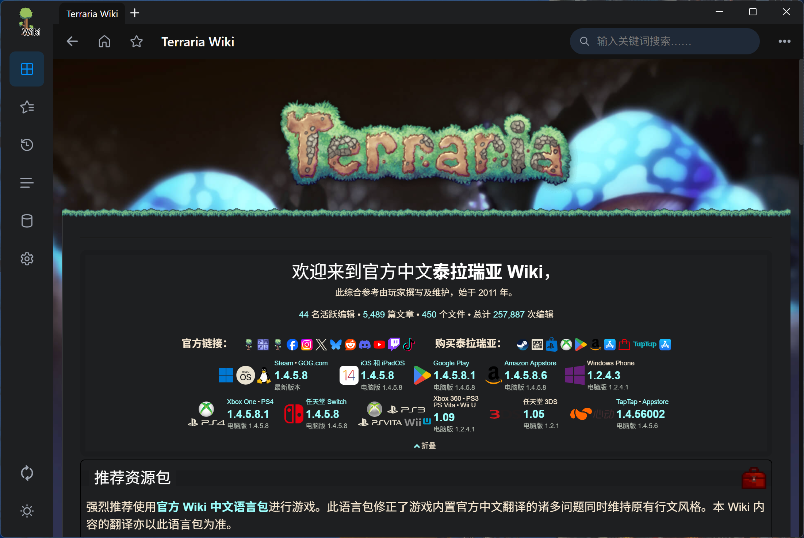
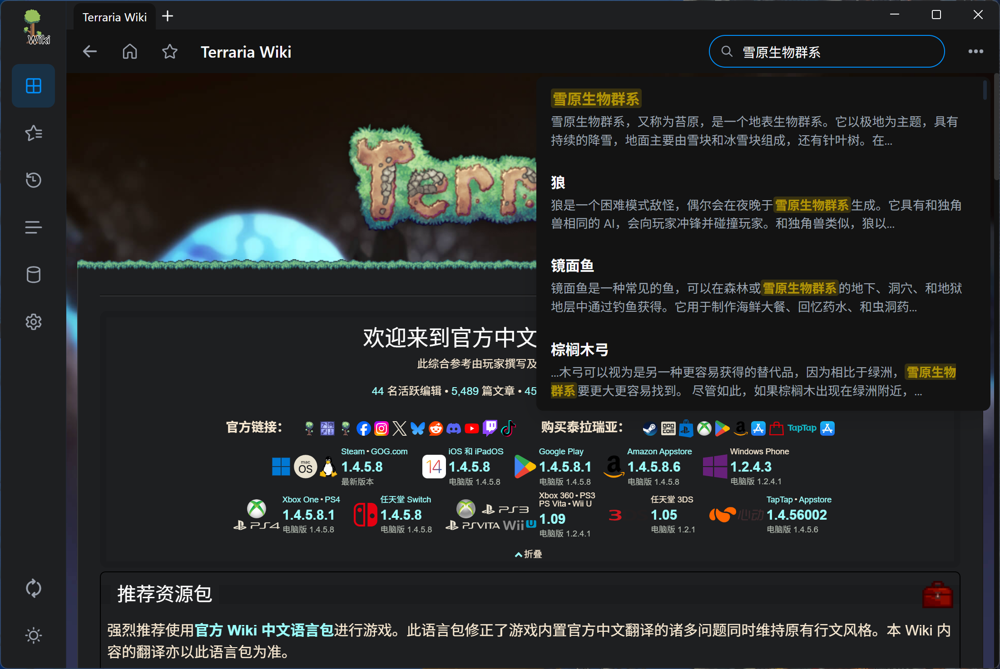
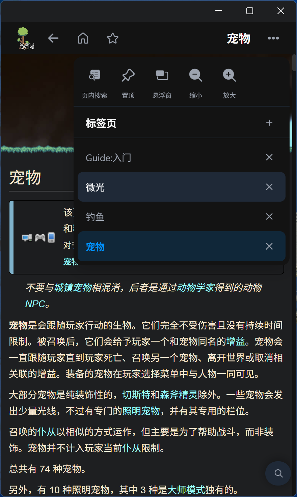
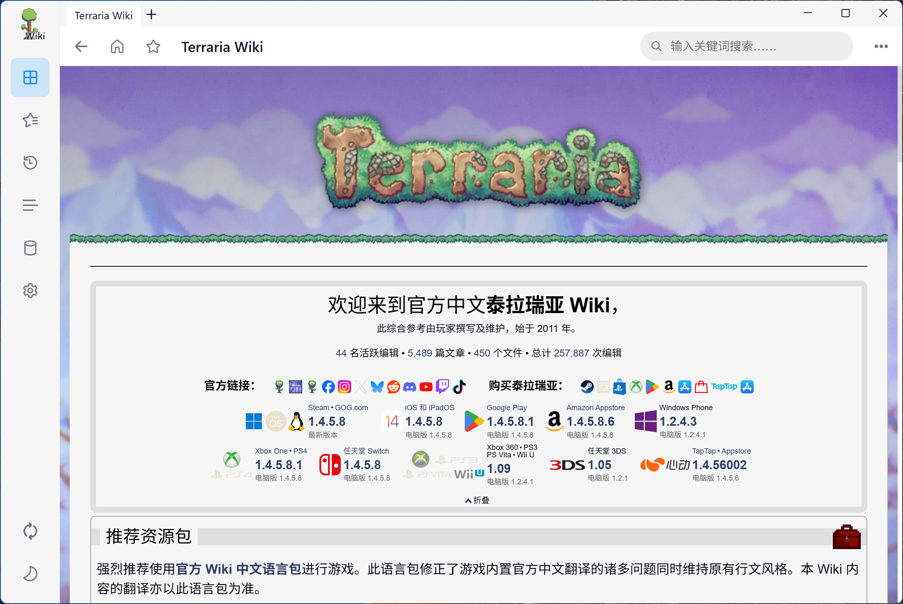
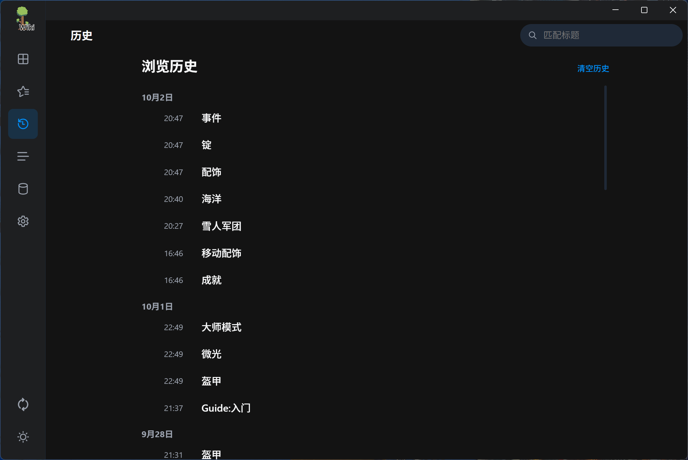
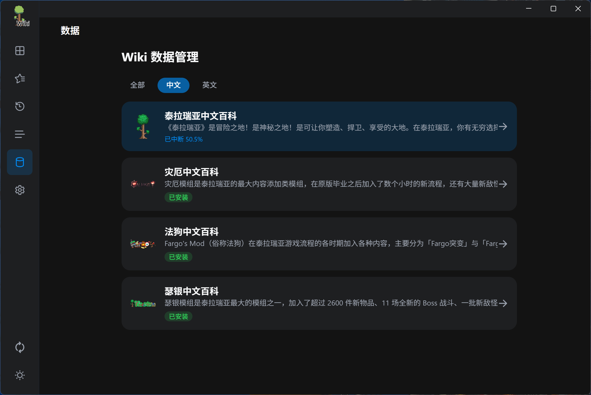
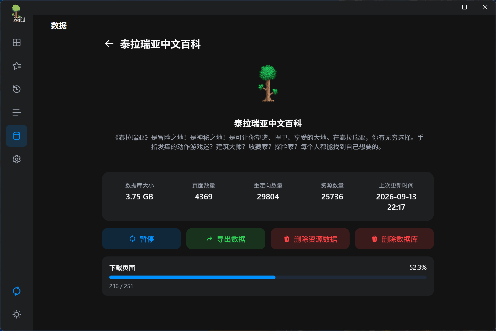
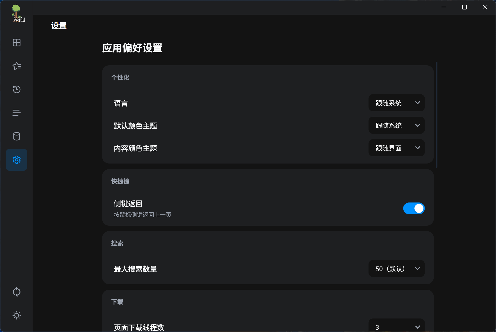
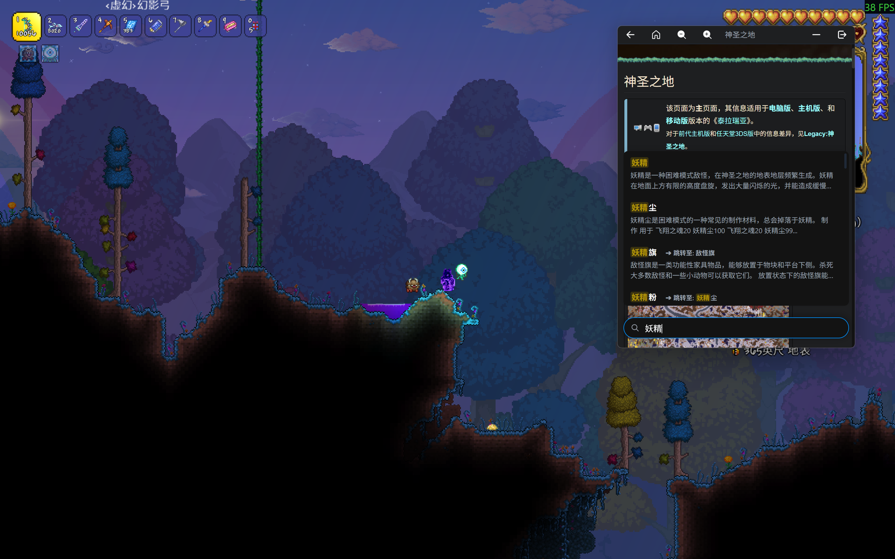

# Terraria Wiki Offline


泰拉瑞亚百科离线阅读器，基于 .NET MAUI Blazor Hybrid 构建。

应用会把 Wiki 的页面正文、图片和音视频抓取到本地 SQLite 数据库，再由内置的本地 HTTP 服务在内嵌 WebView 中渲染，因此断网状态下也能获得与原站一致的排版和阅读体验。目前支持泰拉瑞亚原版、灾厄（Calamity）、法狗（Fargo's Mods）和瑟银（Thorium）四个 Wiki 的中英双语站点，共 8 个数据源。



## 功能特性

- **离线阅读**：词条、图片、音视频全部保存在本地，无需网络。内置本地服务器配合 iframe 渲染，保留原站的样式、信息框、导航框、可折叠表格与数学公式（MathJax）。
- **站内导航**：链接点击无刷新跳转，自动解析重定向与 `#锚点`，锚点指向的折叠内容会自动展开并滚动到位。
- **图片查看**：点击正文图片由 Viewer.js 打开查看器，可缩放、拖动查看原图。
- **页内搜索**：功能栏中的"页内搜索"由原生面板实现，实时显示命中序号与总数。
- **桌面端右键菜单**：复制选中的文字或图片、在新标签页打开词条、打开当前词条的原文页面。
- **实时搜索**：顶栏搜索框基于本地 SQLite 做关键字匹配，下拉面板预览词条及重定向目标，输入带防抖。最大结果数可在设置中调整（25 / 50 / 75 / 100）。
- **所有页面**：列出数据库中的全部词条，支持关键词过滤与虚拟滚动，适合按名称查找。
- **多标签页**：最多同时打开 10 个标签页，每个标签页独立维护标题、滚动位置与浏览历史。桌面端标签栏位于顶栏，窄屏收进功能栏面板。
- **收藏与历史**：顶栏星标即可收藏当前词条；浏览历史按时间轴分组展示，支持一键清空。每个 Wiki 使用独立的数据库文件，收藏与历史互不干扰。
- **多 Wiki 支持**：在数据管理页按语言筛选后点击卡片即可切换 Wiki，切换过程无需重启应用。
- **数据管理**：在线下载（全部内容或仅文本）、增量更新页面、下载或删除图片资源、导出与导入 `.pkg` 数据包、删除数据库，并显示数据库大小、页面数、重定向数、资源数和上次更新时间。
- **任务管理**：下载任务支持暂停、继续、中断恢复与失败项重试，断网时自动暂停，联网后可继续；失败清单可单独清理。
- **主题与外观**：界面语言支持中文与 English；界面主题可选跟随系统、浅色、深色；内容主题可选跟随界面或 Wiki 原版配色。
- **阅读缩放**：功能栏提供 50% 至 200% 的缩放调节（步进 10%，可一键恢复 100%）。
- **桌面端增强**：窗口置顶、Windows 悬浮窗（悬浮球与置顶小窗两种形态，托盘图标可退出）、鼠标侧键返回上一页。
- **移动端适配**：Android 提供网络、通知、后台运行三项权限管理，下载任务可在后台持续运行；iOS 在长时间下载且屏幕闲置时自动调暗屏幕以防止烧屏。

## 界面导览

| 位置 | 说明 |
| --- | --- |
| 主页 | 阅读词条，顶栏提供返回、回到首页、收藏与搜索 |
| 收藏 | 查看已收藏的词条，可取消单个收藏 |
| 历史 | 按时间分组的浏览历史，可一键清空 |
| 所有页面 | 全部词条索引，支持关键词过滤 |
| 数据管理 | 选择 Wiki、下载与更新数据、导出数据包 |
| 设置 | 语言、主题、搜索、下载、权限、数据位置、日志与关于 |
| 功能栏 | 顶栏右侧"更多"按钮：页内搜索、置顶、悬浮窗、缩放、标签页管理 |
| 日志 | 侧边栏底部，显示当前任务与运行日志 |

## 支持的 Wiki

| Wiki | 语言 | 数据目录 |
| --- | --- | --- |
| 泰拉瑞亚中文百科 | 中文 | `Terraria_Wiki_zh` |
| Terraria Wiki | English | `Terraria_Wiki_en` |
| 灾厄中文百科 | 中文 | `Calamity_Wiki_zh` |
| Calamity Mod Wiki | English | `Calamity_Wiki_en` |
| 法狗中文百科 | 中文 | `Fargo_Wiki_zh` |
| Fargo's Mods Wiki | English | `Fargo_Wiki_en` |
| 瑟银中文百科 | 中文 | `Thorium_Wiki_zh` |
| Thorium Mod Wiki | English | `Thorium_Wiki_en` |

## 支持的平台

| 平台 | 最低版本 |
| --- | --- |
| Windows | Windows 10 1809（10.0.17763） |
| Android | Android 7.0（API 24） |
| iOS / iPadOS | iOS 16.4 |

## 安装

安装包请前往 [Releases](https://github.com/BigBearKing/terraria-wiki-offline/releases) 页面获取，当前版本为 v0.4.0。

- **Windows**：免安装，解压后直接运行。需要 Microsoft Edge WebView2 运行时（Windows 11 通常已内置，Windows 10 可能需要手动安装）。
- **Android**：直接安装 APK。首次使用建议在"设置 - 权限管理"中开启网络、通知和后台运行权限，否则下载任务可能被系统中断。
- **iOS / iPadOS**：尚未上架 App Store，需要自行签名后侧载。未经完整测试，运行时可能会出现问题。
- **macOS**：未测试，需要从源码构建。暂未支持，可能会出现很多问题。

## 界面预览

| 搜索 | 多标签页 |
| --- | --- |
|  |  |

| 深色模式 | 收藏与历史 |
| --- | --- |
|  |  |

| 数据管理 | 数据详情 |
| --- | --- |
|  |  |

| 设置 | 悬浮窗（Windows） |
| --- | --- |
|  |  |

## 快速开始

应用本身不包含 Wiki 数据，首次启动需要先加载数据。以下两种方式任选其一。

### 方式一：导入数据包（推荐）

在线抓取整站数据受原站限速影响，完整下载可能需要数小时甚至更久，因此推荐直接导入离线数据包。

1. 下载离线数据包（`.pkg` 文件）。
   - 夸克网盘：<https://pan.quark.cn/s/9e4116487189>，提取码 `J2zU`
2. 打开应用，进入"设置 - 数据 - 导入数据"。
3. 选择 `.pkg` 文件，等待校验与导入完成。
4. 导入结束后即可离线浏览。

### 方式二：在线下载

1. 进入"数据管理"，按语言筛选并选择需要下载的 Wiki。
2. 选择下载内容：
   - **基础数据**：仅包含文本内容、属性和链接关系，约 200 MB。
   - **所有内容**：在基础数据之上追加图片与音视频，体积可达数 GB。
3. 下载过程中可随时暂停或继续；网络中断时任务会自动暂停，恢复网络后继续。
4. 如果只下载了基础数据，之后可以在同一页面点击"下载资源数据"补齐图片。
5. 由于服务器限制，下载时间可能会达到5小时甚至以上。

### 保持数据最新

- 在"数据管理 - 详情"中点击"检查数据更新"，只抓取有改动的页面，比全量下载快很多。
- 在"设置 - 下载"中开启"自动更新页面"，应用启动后会在后台检查并更新页面。

## 常见问题

**打开后正文显示"请先下载数据"，或页面列表是空的？**

还没有加载该 Wiki 的数据。请按上面的"快速开始"导入数据包或在线下载；如果只是缺少图片，可在"数据管理 - 详情"中点击"下载资源数据"。

**数据占用空间太大？**

在"数据管理 - 详情"中点击"删除资源数据"可只保留文本内容，之后随时可以重新下载图片。如果需要彻底释放空间，可点击"删除数据库"，注意这会同时清除该 Wiki 的收藏和浏览历史。

**想把数据放到其他磁盘（Windows）？**

进入"设置 - 数据 - 保存位置"，选择"自定义目录"后点击"应用"，应用会迁移现有数据。迁移期间请勿关闭应用；迁移完成后可以选择删除原目录或保留备份。

**下载中断或出现大量失败项怎么办？**

下载任务支持断点续传，重新进入"数据管理"页面即可看到未完成的任务并继续。页面上会出现"重试失败项"按钮用于重试，也可以在"设置 - 下载"中清理失败列表后重新下载。

**为什么下载速度很慢？**

数据来自各 Wiki 的公开接口，站点对请求频率有限制。设置中的下载线程数不建议调高，过于频繁的请求可能导致服务器拒绝访问。

**Windows 提示未检测到 WebView，应用无法启动？**

安装 [Microsoft Edge WebView2 运行时](https://developer.microsoft.com/microsoft-edge/webview2/)后重新打开应用。

**切换 Wiki 后收藏和历史记录不见了？**

每个 Wiki 使用独立的数据目录和数据库，收藏与历史按 Wiki 分别保存。切换回原来的 Wiki 即可看到原来的记录。

**数据默认存放在哪里？**

Windows 上默认为 `%LOCALAPPDATA%\BigBearKing\com.bigbearking.terrariawiki`，其他平台为应用私有目录。可在"设置 - 数据 - 保存位置"中查看当前路径。

**如何反馈问题？**

请先在"设置 - 日志"中导出日志，然后到 [Issues](https://github.com/BigBearKing/terraria-wiki-offline/issues) 提交，并附上应用版本号、操作系统版本和复现步骤。

## 从源码构建

需要 .NET 11 SDK，并安装 MAUI 工作负载：

```bash
dotnet workload install maui
```

构建指定平台（Windows 示例）：

```bash
dotnet build Terraria_Wiki/Terraria_Wiki.csproj -f net11.0-windows10.0.19041.0 -c Release
```

其余目标框架为 `net11.0-android`、`net11.0-ios`、`net11.0-maccatalyst`（Linux 环境下不包含 Apple 平台）。发布 iOS 未签名 IPA 可在 GitHub Actions 中手动触发 `Build Unsigned iOS IPA` 工作流，产物保留 7 天。

> **注意**：当前 .NET 11 尚未 GA，项目使用 RC.1（`SDK 11.0.100-rc.1` / MAUI `11.0.0-rc.1.26451.6`）。
> 正式版发布后需把依赖版本号改为不带 `rc` 后缀的正式版本。

## 数据来源与版权

- 《泰拉瑞亚》(Terraria) 游戏及相关美术资源版权归 **Re-Logic** 所有。
- 应用会处理来自各 Wiki 的内容；其原始许可、署名和再分发条件见 [CONTENT_ATTRIBUTION.md](CONTENT_ATTRIBUTION.md)。Wiki 页面、图片、音视频和游戏资产不受本仓库 Apache-2.0 许可证授权。
- 应用客户端的原创代码采用 Apache-2.0 许可证；第三方组件按各自许可证提供，详见 [THIRD_PARTY_NOTICES.md](THIRD_PARTY_NOTICES.md)。
- 本软件与 **wiki.gg**、**Re-Logic** 均无任何关联，为个人爱好者开发。

## 开源致谢

- [泰拉瑞亚中文维基](https://terraria.wiki.gg/zh/wiki/Terraria_Wiki) 及各模组 Wiki 社区：本应用的全部内容与数据结构来自社区贡献者的编辑与维护。
- [.NET MAUI](https://github.com/dotnet/maui) 与 [Blazor](https://dotnet.microsoft.com/apps/aspnet/web-apps/blazor)（11.0.0-rc.1）：跨平台 UI 与前端组件框架。
- [Microsoft.Web.WebView2](https://learn.microsoft.com/microsoft-edge/webview2/)（1.0.4191.47）：Windows 端 WebView 内核。
- [HtmlAgilityPack](https://github.com/zzzprojects/html-agility-pack)（1.12.4）：页面数据清洗与解析。
- [sqlite-net-pcl](https://github.com/praeclarum/sqlite-net)（1.11.285）：本地数据库与数据持久化。
- [LuYao.TlsClient](https://github.com/coderbusy/luyao-tls-client)（1.2.0）：部分站点的 TLS 指纹处理。
- [handy-scroll](https://amphiluke.github.io/handy-scroll/)：宽列表滚动条处理。
- [Viewer.js](https://fengyuanchen.github.io/viewerjs/)：图片查看器。
- [MathJax](https://www.mathjax.org/)：数学公式渲染。
- [Fluenticons](https://fluenticons.co/)：应用内图标来源。
- [Nunito](https://fonts.google.com/specimen/Nunito)：界面与页面字体，采用 SIL Open Font License 1.1（许可全文见 [licenses/OFL-1.1.txt](licenses/OFL-1.1.txt)）。

## 赞助与支持

本项目为个人开源项目，无广告。捐助将用于 iOS App Store 的上架费用，捐助时请备注联系方式或 BiliBili UID。

目前累计捐助：180 元。


<details>
<summary>捐助鸣谢</summary>

\*浩、L\*B、\*\*辉、\*南、\*\*鑫、不卜庐七七、\*服、冷月酌OMO

</details>

如果这个项目对你有帮助，欢迎在 GitHub 上点亮 Star，也欢迎关注作者在 [BiliBili 的个人空间](https://space.bilibili.com/470138112)。

## 许可证

本项目的原创客户端代码采用 [Apache-2.0](LICENSE) 许可证。Wiki 内容、游戏资产和第三方组件不由该许可证授权；请同时阅读 [CONTENT_ATTRIBUTION.md](CONTENT_ATTRIBUTION.md) 与 [THIRD_PARTY_NOTICES.md](THIRD_PARTY_NOTICES.md)。
